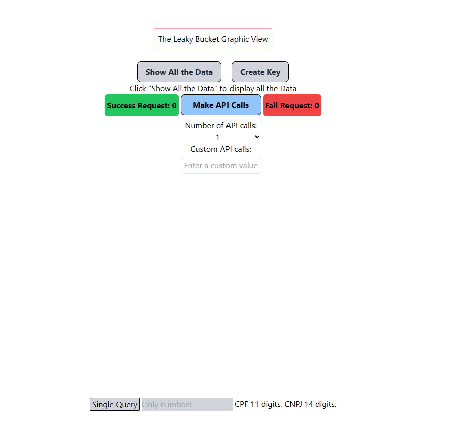

# Leaky Bucket Implementation with Redis and Node

This repository contains an implementation of a Leaky Bucket algorithm using Redis and Node.js. The Leaky Bucket algorithm is commonly used for rate limiting and traffic shaping. In this implementation, we leverage the power of Redis for efficient token storage and retrieval.

## Installation

1. Clone the repository:

   
git clone https://github.com/kingjotaro/leaky-bucket
   
1. Install dependencies:

   
   cd leaky-bucket
   npm install

   
2. Get your enviroment [variables](https://developers.celcoin.com.br/docs/obtendo-acesso-%C3%A0s-apis)

   
3. Set up your environment variables in server:
   Create a `.env` file in the root server directory and provide the following variables:

   * CELCOIN_CLIENT_ID=your_client_id
   * CELCOIN_CLIENT_SECRET=your_client_secret
   * CELCOIN_GRANT_TYPE=your_grant_type
   * REDIS_PASSWORD=your_redis_password
   * REDIS_HOST=your_redis_host
   * REDIS_PORT=your_redis_port

  

   
## Usage

Start the application using the following commands:
"turbo dev",
"turbo dev1",
"turbo dev2",
"turbo dev3",
each one of these has its own proper configuration, read the [gist](./gist.md) for more information

The server should be launch on port 3000 as default
And the frontend in port 5173

## Interface usage

This is our simples interface, to use that is pretty simlple. 

- Button **Show All the Data** Show all the data stored in Redis.

- Button **Make API Call** Make the number of request that you have selectioned with a random CPF.

- Button **Single Query** Make a single query with the CPF or CPNJ number that you have informed and show the response data.

- Button **Create Key** create a key to use the API. 

## API Endpoints

### 1. Get All Keys in Redis

- **Endpoint:** `/`
- **Method:** `GET`
- **Description:** Retrieves all keys stored in the Leaky Bucket.

### 2. Create Celcoin Key

- **Endpoint:** `/createkey`
- **Method:** `GET`
- **Description:** Generates and stores a Celcoin keys in Redis for 40 minutes
- **Response:** 'Key created'

### 3. Verify Celcoin Key
- **Endpoint:** /verifykey
- **Method:** `GET`
- **Description:**  Verifies the existence of a key in the Leaky Bucket. If the key does not exist, it redirects to /createkey.
- **Response:** 'Key verification successful.' is currently the only response provided.

### 4. Query a random CPF at Celcoin API
- **Endpoint:** /getrandom
- **Method:** `GET`
- **Description:**  Get a random CPF number and query.
- **Response:** 
-     Status Code: 200 OK for successful query
-     Status Code: 500 Internal Server Error 

### 5. Query a CPF or CNPJ 
- **Endpoint:** /get/{CPForCNPJ}
- **Method:** `GET`
- **Description:**  This method will search for a CPF or a CNPJ in Redis memory. If it doesn't find anything in Redis, it will query the Celcoin API, retrieve the result, and save it in Redis.
- **Response:** 

### Backend Dependencies

## DevDependencies

- `@types/jest`: ^29.5.11
- `@types/koa`: ^2.13.12
- `@types/koa-router`: ^7.4.8
- `@types/redis`: ^4.0.11
- `dotenv`: ^16.3.1
- `esbuild-register`: ^3.5.0
- `jest`: ^29.7.0
- `supertest`: ^6.3.3
- `ts-jest`: ^29.1.1
- `ts-node`: ^10.9.2
- `typescript`: ^5.3.3

## Dependencies

- `@types/koa-bodyparser`: ^4.3.12
- `api`: ^6.1.1
- `koa`: ^2.14.2
- `koa-bodyparser`: ^4.4.1
- `koa-router`: ^12.0.1
- `koa-ratelimit`: "^5.1.0",
- `koa2-cors`: "^2.0.6",
- `node-schedule`: ^2.1.1
- `redis`: ^4.6.11

### Frontend Dependecies

## DevDependencies
- `@types/react"`: "^18.2.43",
- `@types/react-dom"`: "^18.2.17",
- `@vitejs/plugin-react"`: "^4.2.1",
- `autoprefixer"`: "^10.4.16",
- `eslint"`: "^8.55.0",
- `eslint-plugin-react"`: "^7.33.2",
- `eslint-plugin-react-hooks"`: "^4.6.0",
- `eslint-plugin-react-refresh"`: "^0.4.5",
- `postcss-import"`: "^16.0.0",
- `prettier"`: "^3.1.1",
- `vite"`: "^5.0.8"
- `prettier-plugin-tailwindcss"`: "^0.5.10",
- `tailwindcss"`: "^3.4.0",

## Dependencies

- `@nivo/bump"`: "^0.84.0",
- `"@nivo/line"`: "^0.84.0",
- `"@nivo/pie"`: "^0.84.0",
- `"react"`: "^18.2.0",
- `"react-countdown"`: "^2.3.5",
- `"react-dom"`: "^18.2.0"

## License

This project is licensed under the ISC License - see the [LICENSE.md](LICENSE.md) file for details.

## Author

@kingjotaro

Feel free to contribute, report issues, or make suggestions!